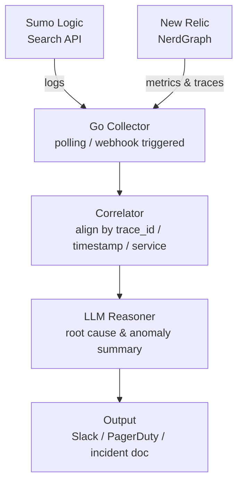
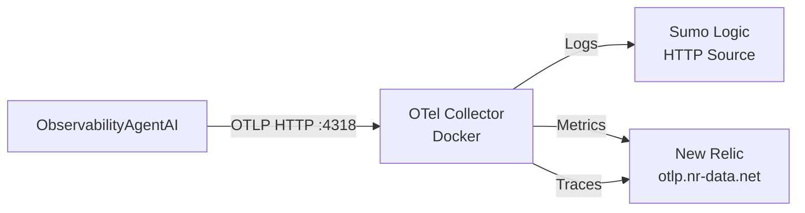

# ObservabilityAgentAI

An AI-powered observability agent written in Go that correlates logs from **Sumo Logic** with metrics and traces shipped to **New Relic**, then uses an LLM to reason about root cause and produce human-readable incident summaries.

## The Problem

During an incident, SREs context-switch between Sumo Logic (logs) and New Relic (metrics/traces), manually correlating timestamps, trace IDs, and service names. This takes time — time you don't have at 2am.

ObservabilityAgentAI automates that first pass:
1. Pulls logs from Sumo Logic via Search Job API
2. Correlates signals by trace ID, timestamp, and service name
3. Feeds the correlated bundle to an LLM for root cause analysis
4. Delivers a structured incident summary to Slack or PagerDuty

## Architecture



## Observability of the Agent Itself

The agent is self-instrumented using **OpenTelemetry**:

- **Logs** → stdout → OTel Collector → Sumo Logic
- **Metrics** → OTel Collector → New Relic
- **Traces** → OTel Collector → New Relic

Key metrics tracked in New Relic:

| Metric | Description |
|---|---|
| `sumo.query.duration` | How long Sumo Logic search jobs take end to end |
| `llm.request.duration` | How long the LLM takes to respond |
| `agent.run.duration` | Total end to end agent run time |

## Tech Stack

| Concern | Choice |
|---|---|
| Language | Go 1.22+ |
| Logs | Sumo Logic Search Job API |
| Metrics/Traces | New Relic via OTel |
| Telemetry | OpenTelemetry (OTLP HTTP) |
| LLM | Claude API (Anthropic) |
| Collector | OTel Collector Contrib (Docker) |
| Output | Slack / PagerDuty |
| Deployment | Kubernetes |

## Project Structure

```
ObservabilityAgentAI/
├── cmd/
│   └── observabilityagentai/   # main entrypoint
├── config/
│   ├── config.go               # config loader
│   └── config.example.yaml     # example config
├── internal/
│   ├── sumologic/              # Sumo Logic Search Job API client
│   │   ├── client.go
│   │   ├── model.go
│   │   └── search.go
│   ├── newrelic/               # New Relic client
│   │   └── client.go
│   ├── correlator/             # event correlation logic
│   ├── reasoner/               # LLM prompt construction + calls
│   ├── output/                 # Slack/PagerDuty notifiers
│   ├── store/                  # incident history persistence
│   └── telemetry/              # OTel setup + metrics
│       ├── telemetry.go
│       └── metrics.go
├── pkg/
│   └── models/                 # shared Event/Incident structs
│       └── events.go
├── deploy/
│   └── local/
│       ├── docker-compose.yml          # OTel Collector
│       └── otel-collector-config.yaml  # routes logs/metrics/traces
├── go.mod
└── README.md
```

## Getting Started

### Prerequisites

- Go 1.22+
- Docker + Docker Compose
- Sumo Logic account with Search Job API access
- New Relic account with ingest license key
- Anthropic API key

### Environment Variables

```bash
# Sumo Logic
SUMOLOGIC_ACCESSID_SANDBOX=your-access-id
SUMOLOGIC_ACCESSKEY_SANDBOX=your-access-key

# New Relic
NEWRELIC_APIKEY_SANDBOX=your-api-key
NEWRELIC_ACCOUNTID_SANDBOX=your-account-id

# OTel
OTEL_EXPORTER=http
OTEL_ENDPOINT=http://localhost:4318

# App
SERVICE_NAME=ObsAIAgent
ENVIRONMENT=dev
```

### Run the OTel Collector

Fill in your credentials first:
```bash
cp deploy/local/.env.example deploy/local/.env
# edit .env with your Sumo Logic and New Relic credentials
```

Start the collector:
```bash
cd deploy/local
docker-compose up -d
```

### Run the Agent

```bash
go build -o obsaiagent ./cmd/observabilityagentai
./obsaiagent
```

## Roadmap

| Phase | Status | Description |
|---|---|---|
| 1 | 🚧 In Progress | Data clients — Sumo Logic + New Relic, independently testable |
| 2 | ⏳ Pending | Correlator — normalize and align signals by trace ID / time window |
| 3 | ⏳ Pending | LLM Reasoner — structured prompt to Claude, JSON output |
| 4 | ⏳ Pending | Event-driven trigger via NRQL alert webhook |
| 5 | ⏳ Pending | Slack output with dashboard deep links |
| 6 | ⏳ Stretch | Incident history + RAG-style feedback loop |

## OTel Collector Data Flow



Swapping to production = change env vars only, zero code changes.
